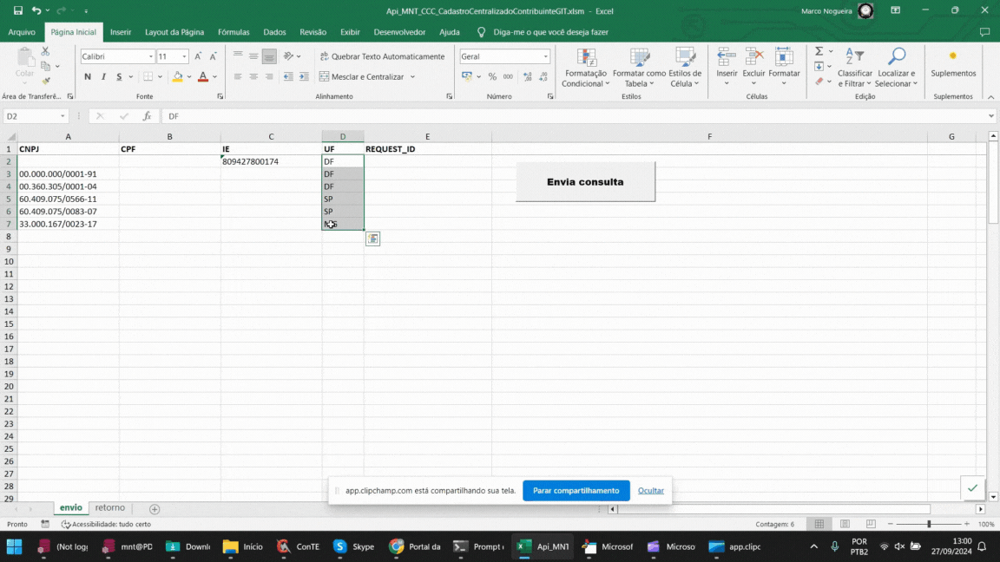
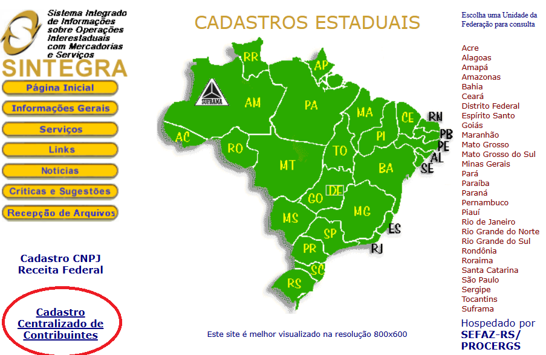
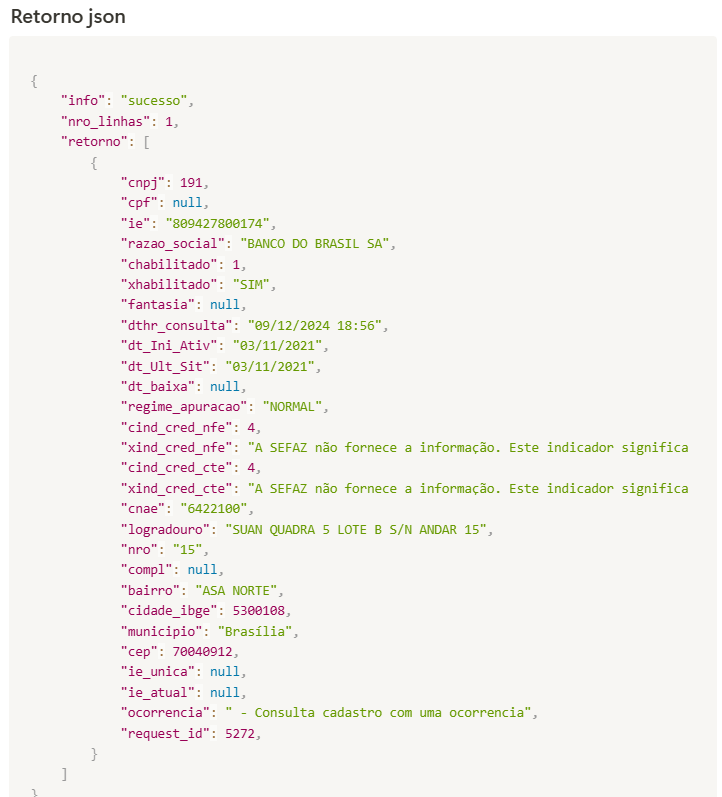

<h1>📌 API Sintegra Unificado no Excel</h1>

Excel projetado para realizar consultas de CNPJ, CPF ou IE em massa, integrando dados em tempo real diretamente do Sintegra.

Com uma interface intuitiva, permite a consulta simultânea de múltiplos CNPJs, CPF´s ou IE´s de acordo com suas necessidades.

As informações coletadas são apresentadas na planilhas de retorno, proporcionando uma visão clara e estruturada dos dados obtidos, como Razão Social ou nome do Contribuinte, Situação do contribuinte (Não habilitado ou Habilitado), Indicador de contribuinte credenciado a emitir CT-e, Indicador de contribuinte credenciado a emitir NF-e, Regime de Apuração do ICMS do Contribuinte, CNAE, Data de ocorrência da baixa, Logradouro, Número, Município e mais.

 

<h3>🚀 Tecnologias Utilizadas</h3>

Excel, VBA e API´s arquivo-nfe.com

 

<h3>📂 Estrutura do Projeto</h3>

Api_MNT_Sintegra_Unificado.xlsm

 

<h3>⚙️ Como utilizar? </h3>

1 - Cadastre-se grátis 

[Portal](https://g120c7c9d7b60c3-mnt.adb.sa-vinhedo-1.oraclecloudapps.com/ords/r/wksp_mnt/anfe/login)

2 - Após o cadastro, faça o login no portal e copie seu código de cliente na página "Meu token".

3 - Faça o download do Excel (github ou site abaixo) e na guia configuração, preencha sua chave de registro para uso da API.

https://www.arquivo-nfe.com/api-sintegra-ccc-excel

 

Execute a imagem gif abaixo para visualizar o funcionamento

<!---->

 

<h1>📌 API Sintegra Unificado - Consulta Cadastro Centralizado de Contribuintes</h1>

A API Sintegra / Consulta Cadastro Centralizado de Contribuinte (CCC) automatiza o processo de validação de informações no cadastro de novos clientes ou fornecedores e na emissão de nota fiscal, com o objetivo de garantir a conformidade das informações do destinatário nas operações internas ou interestadual. A consulta é realizada em tempo real na fonte pública oficial, mantida pela SEFAZ RS com outras secretarias de estado da fazenda do Brasil. 

 

<h3>Usos comuns</h3>

<ul>
<li>  
Pode ser usada para verificar a situação do contribuinte antes da emissão de notas fiscais de entrada (emissão própria).
</li>
<li>  
Pode ser usada como alternativa à pesquisa de SINTEGRA estadual.
</li>
<li>
Pode ser usado em gestão cadastral e fiscal, confirmando se os dados estão corretos e atualizados.
</li>
<li>  
Pode ser usada para verificar o regime de tributação de uma empresa.
</li>
<li>
Pode ser usada para criação de dossiês ou em processos de KYC (Know Your Customer, ou, Conheça Seu Cliente)
</li>

 

 

<h3>Como utilizar?</h3>

https://www.arquivo-nfe.com/api-sintegra-ccc

 

<h3>📝 Licença</h3>

🚀 Aproveite o Plano FREE das Nossas APIs Sintegra Unificado e CNPJ Receita! 🔥

 

Made with ❤️ by ArquivoNfe. All rights reserved.  🚀
